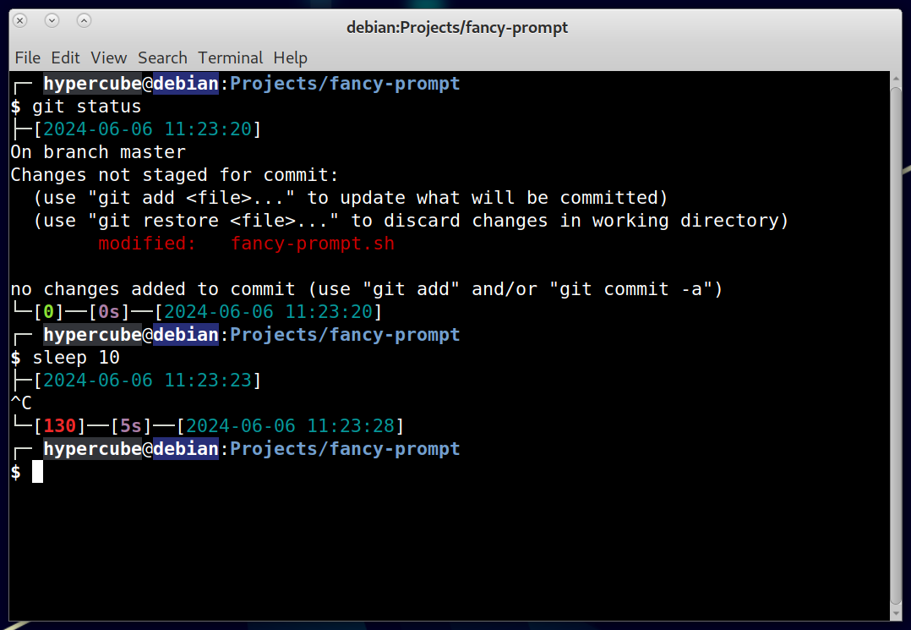

# Hypercube's fancy prompt



## Features

- [x] Display user, hostname, and path in SSH style.
- [x] Use colors.
- [x] Generate hash-based colors for user and hostname.
- [x] Put command on a separate line.
- [x] Set a concise window title.
- [x] Display command start time, duration, and end time.
- [x] Ring bell after long-running commands finish.
- [x] Display command exit code.
- [x] Add a mark when output doesn't end at the first column.
- [ ] Show running jobs.
- [ ] Display history number.
- [ ] Save and load command history.
- [ ] List items in current directory.
- [ ] Display git status.

## Installation

Download the `fancy-prompt.sh` script:

```bash
wget -O ~/.fancy-prompt.sh https://raw.githubusercontent.com/SmartHypercube/fancy-prompt/master/fancy-prompt.sh
```

Source the script in your `.bashrc`:

```bash
echo 'source ~/.fancy-prompt.sh' >> ~/.bashrc
```

If you set the `TZ` environment variable in your `.bashrc` or `.profile`, make sure to set it before sourcing the script.
